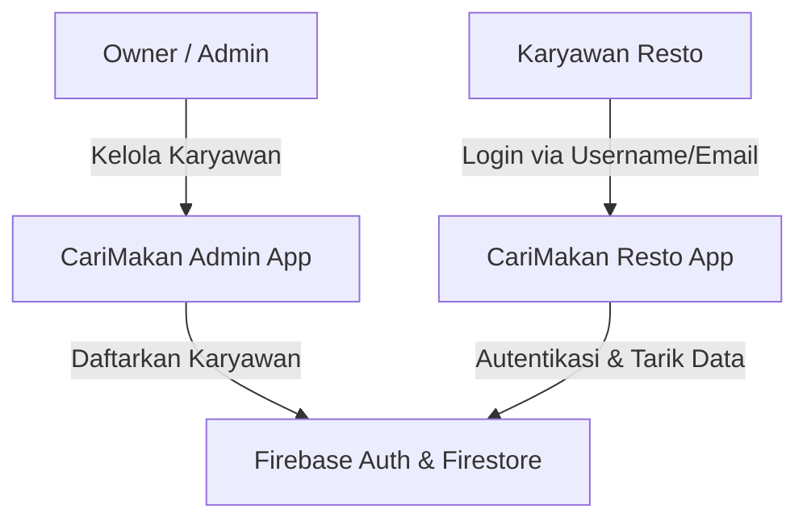

# Rencana Implementasi Manajemen Karyawan (CariMakan)

Dokumen ini menjelaskan rancangan arsitektur, skema database, serta alur implementasi fitur manajemen karyawan untuk aplikasi **CariMakan** (sisi Resto/Karyawan) dan **CariMakan Admin** (sisi Owner).

---

## 1. Ikhtisar Arsitektur (Architecture Overview)

Sistem CariMakan menggunakan dua aplikasi yang terhubung ke satu proyek Firebase yang sama:
1. **CariMakan (Aplikasi ini)**: Digunakan oleh Pelanggan dan Karyawan Resto.
2. **CariMakan Admin (Aplikasi terpisah)**: Digunakan oleh Owner Resto untuk mengelola menu, karyawan, dan melihat laporan keuangan.



---

## 2. Skema Database Firestore

Untuk mendukung manajemen karyawan, kita membutuhkan data yang terstruktur di Firestore.

### Koleksi: `restaurants`
Menyimpan informasi tentang restoran.
*   Path: `/restaurants/{restaurant_id}`
*   Struktur dokumen:
    ```json
    {
      "id": "resto_id_123",
      "name": "Sate Khas Senayan - Cabang Depok",
      "address": "Jl. Margonda Raya No. 12",
      "status_active": true,
      "created_at": "Timestamp"
    }
    ```

### Koleksi: `users`
Menyimpan profil pengguna baik itu Owner maupun Karyawan. Dokumen ID disamakan dengan `uid` dari Firebase Auth.
*   Path: `/users/{uid}`
*   Struktur dokumen:
    ```json
    {
      "uid": "USER_UID_DARI_FIREBASE_AUTH",
      "name": "Budi Santoso",
      "username": "budi_sate",
      "email": "budi_sate@carimakan.internal", // Email virtual untuk Firebase Auth
      "role": "karyawan", // "owner" atau "karyawan"
      "restaurant_id": "resto_id_123", // Referensi ke resto tempat bertugas
      "status_active": true, // Status aktif bertugas
      "created_at": "Timestamp"
    }
    ```

---

## 3. Strategi Autentikasi (Login & Registrasi Karyawan)

### A. Registrasi Akun Karyawan oleh Owner (Tantangan Multi-Session)
Firebase Auth secara default akan otomatis men-sign-in akun yang baru dibuat secara lokal. Untuk menghindari ter-logout-nya Owner saat mendaftarkan karyawan baru di aplikasi Admin, kita akan menggunakan **Trik Firebase Auth Secondary App**:

Di aplikasi Admin, kita menginisialisasi instance Firebase Auth kedua khusus untuk pendaftaran:
```dart
FirebaseApp tempApp = await Firebase.initializeApp(
  name: 'TemporaryRegisterApp',
  options: Firebase.app().options,
);
FirebaseAuth tempAuth = FirebaseAuth.instanceFor(app: tempApp);

// Buat user karyawan tanpa mengganggu session Owner di Auth utama
UserCredential cred = await tempAuth.createUserWithEmailAndPassword(
  email: '$username@carimakan.internal',
  password: password,
);

// Hapus aplikasi sementara setelah selesai
await tempApp.delete();
```

### B. Mekanisme Login Menggunakan Username
Karena Firebase Auth membutuhkan format email, kita akan mengonversi username karyawan menjadi email virtual dengan domain internal (`@carimakan.internal`) secara transparan di latar belakang:

1. Karyawan menginput `budi_sate` di field **Email/Username**.
2. Aplikasi mendeteksi apakah input mengandung karakter `@`.
3. Jika **tidak** mengandung `@`, aplikasi otomatis memformat input menjadi `budi_sate@carimakan.internal` sebelum memanggil `signInWithEmailAndPassword()`.
4. Jika **mengandung** `@`, aplikasi memperlakukannya sebagai email biasa (misal untuk Owner yang login menggunakan email aslinya).

---

## 4. Alur Kerja Implementasi (Workflow)

### Tahap 1: Persiapan Firebase di Repo CariMakan (Repo Ini)
1. Sambungkan project Flutter ini ke Firebase (melalui `flutterfire configure`).
2. Pasang library yang dibutuhkan pada `pubspec.yaml`:
   * `firebase_core`
   * `firebase_auth`
   * `cloud_firestore`

### Tahap 2: Penyesuaian Halaman Login (Selesai Sebagian)
* [x] Mengubah field email menjadi **Email / Username**.
* [x] Memodifikasi regex validasi input agar memperbolehkan login non-email (username).
* [ ] Menambahkan logika translasi username ke email virtual sebelum memanggil fungsi Firebase Auth:
  ```dart
  String finalEmail = input;
  if (!input.contains('@')) {
    finalEmail = '$input@carimakan.internal';
  }
  ```

### Tahap 3: Proteksi Rute & Status Karyawan
Setelah login berhasil, sistem harus melakukan pemeriksaan data di Firestore:
1. Tarik dokumen user dari `/users/{uid}`.
2. Pastikan `role` adalah `karyawan` dan `status_active` bernilai `true`.
3. Simpan `restaurant_id` ke dalam global state/provider.
4. Jika tidak valid, lakukan logout otomatis dan tampilkan pesan kesalahan.

---

## 5. Rencana Pengujian (Testing Plan)

1. **Uji Coba Registrasi**:
   * Daftarkan akun karyawan baru melalui console Firebase / aplikasi Admin dengan username `karyawan_test` dan password `password123`.
   * Pastikan dokumen baru terbentuk di Firestore pada koleksi `users`.
2. **Uji Coba Login**:
   * Lakukan login pada aplikasi CariMakan menggunakan username `karyawan_test` dan password `password123`.
   * Pastikan login berhasil masuk ke `KaryawanHomePage`.
3. **Uji Coba Filter Order**:
   * Buat beberapa order dummy di Firestore dengan `restaurant_id` yang berbeda.
   * Pastikan hanya orderan yang memiliki `restaurant_id` sama dengan milik karyawan tersebut yang muncul di halaman beranda.
