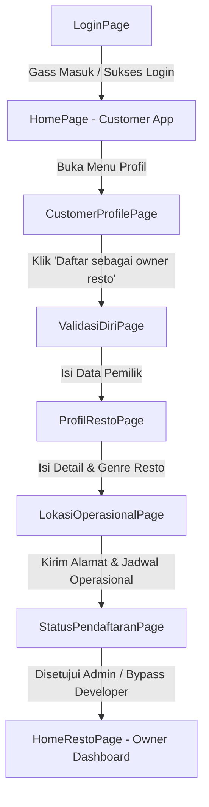

# Technical Specification: CariMakan Application

Dokumen ini merangkum spesifikasi teknis, arsitektur, dan kemajuan implementasi aplikasi **CariMakan** (terutama alur Pendaftaran Resto dan Dashboard Owner Resto) sejauh ini.

---

## 1. Ikhtisar Aplikasi (App Overview)
CariMakan adalah aplikasi mobile berbasis **Flutter** yang menghubungkan pelanggan dengan pemilik restoran (*Owner Resto*). Aplikasi ini dirancang menggunakan prinsip **Clean UI/UX** (desain premium, mengambang/modern, mikro-animasi dinamis) dan **Clean Architecture** yang terstruktur.

---

## 2. Alur Pengguna: Dari Customer Login ke Owner Resto (User Journey)

Aplikasi CariMakan mengintegrasikan alur pengguna secara dinamis mulai dari masuk sebagai pelanggan biasa hingga bertransisi menjadi pemilik restoran (*Owner Resto*):



### Tahapan Alur & Integrasi Kode:
1.  **Login Awal Customer (`LoginPage`):**
    *   Pengguna memasukkan email dan password di [login_page.dart](file:///c:/laragon/www/CariMakan/lib/features/login/pages/login_page.dart).
    *   Setelah menekan tombol **"Gass Masuk"**, pengguna diarahkan menggunakan transisi geser vertikal kustom (`PageRouteBuilder`) ke halaman beranda pelanggan di [home_page.dart](file:///c:/laragon/www/CariMakan/lib/features/home/presentation/pages/home_page.dart).
2.  **Transisi ke Pendaftaran Resto (`CustomerProfilePage`):**
    *   Dari beranda pelanggan, pengguna dapat masuk ke tab Profil yaitu [customer_profile_page.dart](file:///c:/laragon/www/CariMakan/lib/features/profile/presentation/pages/customer_profile_page.dart).
    *   Di halaman profil terdapat tombol khusus **`_buildBecomeOwnerButton()`** bertuliskan **"Daftar sebagai owner resto"**.
    *   Ketika tombol diklik, sistem akan melakukan navigasi `Navigator.push` ke [validasi_diri_page.dart](file:///c:/laragon/www/CariMakan/lib/features/pendaftaran_resto/presentation/pages/validasi_diri_page.dart) untuk memulai rangkaian pendaftaran.
3.  **Proses Pendaftaran Bertahap:**
    *   Pengguna melengkapi data identitas di **ValidasiDiriPage**, meluncur ke **ProfilRestoPage** untuk spesifikasi restoran, lalu ke **LokasiOperasionalPage** untuk pengaturan peta & operasional jam kerja harian.
    *   Setelah tombol **"Kirim"** ditekan, pengguna diarahkan ke **StatusPendaftaranPage** yang memantau peninjauan data oleh Admin secara langsung.
4.  **Masuk ke Dashboard Owner (`HomeRestoPage`):**
    *   Begitu status pendaftaran disetujui (atau dilewati menggunakan bypass developer `>>`), tombol utama akan berubah menjadi **"Masuk ke Dashboard Resto"**.
    *   Mengklik tombol ini akan memicu navigasi `Navigator.pushReplacement` yang membersihkan rute sebelumnya dan meluncurkan antarmuka khusus owner di [home_resto_page.dart](file:///c:/laragon/www/CariMakan/lib/features/home_resto/presentation/pages/home_resto_page.dart).

---

## 3. Rancangan Skema Database (NoSQL Firestore / Relational Tables)

CariMakan diintegrasikan dengan Firebase (Firestore & Auth) sebagai *backend* utama. Berikut adalah pemodelan skema dokumen / tabel yang dirancang untuk mendukung alur pendaftaran dan transaksi resto:

### A. Tabel/Koleksi `users`
Menyimpan data otentikasi dan profil dasar pengguna baik sebagai pelanggan maupun pemilik.
*   **`uid`** (String, Primary Key): ID pengguna unik hasil dari Firebase Auth.
*   **`name`** (String): Nama lengkap pengguna.
*   **`email`** (String): Alamat email terdaftar.
*   **`role`** (String): Peran pengguna (`'customer'` atau `'owner'`).
*   **`createdAt`** (Timestamp): Waktu pembuatan akun.

### B. Tabel/Koleksi `restaurants`
Menyimpan profil lengkap restoran beserta data verifikasi pemilik restoran yang mendaftar.
*   **`restoId`** (String, Primary Key): ID unik restoran.
*   **`ownerId`** (String, Foreign Key -> `users.uid`): ID pengguna pemilik restoran.
*   **`ownerName`** (String): Nama pemilik (dari Validasi Diri).
*   **`ownerNik`** (String): NIK KTP pemilik (dari Validasi Diri).
*   **`ownerPhone`** (String): Nomor telepon aktif pemilik (dari Validasi Diri).
*   **`restoName`** (String): Nama restoran (dari Profil Resto).
*   **`restoDescription`** (String): Deskripsi singkat restoran (dari Profil Resto).
*   **`restoAddress`** (String): Alamat lengkap restoran (dari Lokasi & Operasional).
*   **`latitude`** (Double): Koordinat lintang peta.
*   **`longitude`** (Double): Koordinat bujur peta.
*   **`genres`** (List<String>): Daftar kategori makanan (misal: `['Mie', 'Minuman']`).
*   **`facilities`** (List<String>): Fasilitas restoran (misal: `['WiFi', 'Parkir']`).
*   **`imageUrl`** (String): URL foto banner/profil restoran.
*   **`status`** (String): Status pendaftaran (`'pending'`, `'approved'`, `'rejected'`).
*   **`rejectedReason`** (String, Optional): Alasan penolakan dari admin.
*   **`createdAt`** (Timestamp): Tanggal pengajuan pendaftaran.

### C. Sub-Koleksi/Tabel `operational_hours`
Detail jadwal buka-tutup restoran untuk setiap hari dalam seminggu.
*   **`day`** (String, Primary Key): Nama hari (`'Senin'`, `'Selasa'`, dst.).
*   **`isOpen`** (Boolean): Status buka/tutup pada hari tersebut (centang/uncheck).
*   **`openTime`** (String): Jam operasional buka (format `HH:mm`, contoh: `'08:00'`).
*   **`closeTime`** (String): Jam operasional tutup (format `HH:mm`, contoh: `'21:00'`).

### D. Tabel/Koleksi `orders`
Mencatat transaksi pesanan aktif dan riwayat pemesanan yang masuk ke dapur restoran.
*   **`orderId`** (String, Primary Key): ID unik pesanan.
*   **`restoId`** (String, Foreign Key -> `restaurants.restoId`): ID restoran tujuan.
*   **`customerId`** (String, Foreign Key -> `users.uid`): ID pelanggan pemesan.
*   **`queueNumber`** (String): Nomor urut antrean antrean (contoh: `'#10'`).
*   **`type`** (String): Mode pemesanan (`'Dine In'` atau `'Take Away'`).
*   **`tableNumber`** (String, Optional): Nomor meja (khusus tipe 'Dine In').
*   **`status`** (String): Status progres pesanan (`'proses'`, `'selesai'`, `'batal'`).
*   **`totalPrice`** (Double): Total nilai belanjaan.
*   **`createdAt`** (Timestamp): Waktu pesanan masuk.
*   **`items`** (List<Map>): Rincian item pesanan:
    *   `menuName` (String): Nama item makanan.
    *   `quantity` (Integer): Jumlah porsi dipesan.
    *   `price` (Double): Harga satuan.

### E. Tabel/Koleksi `menus`
Menampung daftar menu makanan/minuman yang ditawarkan oleh restoran.
*   **`menuId`** (String, Primary Key): ID unik menu.
*   **`restoId`** (String, Foreign Key -> `restaurants.restoId`): ID restoran pemilik menu.
*   **`name`** (String): Nama menu makanan/minuman.
*   **`price`** (Double): Harga menu.
*   **`category`** (String): Kategori item (`'Makanan'` atau `'Minuman'`).
*   **`imageUrl`** (String): URL foto makanan.
*   **`isAvailable`** (Boolean): Status ketersediaan menu.
*   **`soldCount`** (Integer): Total porsi terjual (untuk kalkulasi menu terlaris).

---

## 4. Palet Warna & Identitas Visual (Design Token)
Berikut adalah kode warna utama yang disepakati dan diimplementasikan:
*   **Merah Utama (CariMakan Red):** `#C21111` / `#ED001E`
*   **Warna Latar Belakang Aplikasi:** `#EFEFEF` (Abu-abu terang premium)
*   **Warna Latar Belakang Kontainer/Card:** `#FFFFFF`
*   **Warna Latar Belakang Navbar:** `#1C1C1C` (Hitam keabuan)
*   **Warna Inaktif Item Navbar:** `#353535`
*   **Warna Oranye (Highlight Total Order):** `#E3861B`
*   **Warna Teks Redup/Subtitle:** `#989898` / `#7C7C7C`

---

## 5. Fitur Utama & Progress Implementasi (Features & Progress)

### A. Alur Pendaftaran Resto (Registration Flow)
Alur pendaftaran bagi pemilik restoran baru dirancang dengan layout berlapis (menggunakan *Stack* dan *Positioned content* ter-clip) agar konten tidak menabrak App Bar, serta menggunakan tombol floating transparan di bagian bawah.
1.  **Halaman Validasi Diri (`validasi_diri_page.dart`):** Pengumpulan data awal pemilik restoran.
2.  **Halaman Profil Resto (`profil_resto_page.dart`):** Pengaturan detail informasi restoran, genre kuliner, fasilitas, dan foto profil.
3.  **Halaman Lokasi & Operasional (`lokasi_operasional_page.dart`):**
    *   Input alamat fisik & koordinat.
    *   Integrasi peta interaktif (*mockup map card*).
    *   Pilihan operasional harian dinamis (hari bisa dicentang/uncheck jika libur, dilengkapi *custom time picker* untuk jam buka dan jam tutup).
4.  **Halaman Status Pendaftaran (`status_pendaftaran_page.dart`):**
    *   Visualisasi 3 status pendaftaran: **Pending (Menunggu)**, **Approved (Berhasil)**, dan **Rejected (Ditolak)** menggunakan ilustrasi vektor 2D minimalis yang konsisten.
    *   **Fitur Developer (Test Mode):** Ketuk ganda (*double-tap*) pada ilustrasi status untuk melakukan siklus perputaran status secara langsung.
    *   **Fitur Developer (Bypass Button):** Ikon tombol `>>` (*fast forward*) di kanan atas layar untuk melewati pemeriksaan status dan langsung masuk ke Dashboard Owner.

---

### B. Dashboard / Home Screen Owner Resto (`home_resto`)
Dashboard utama bagi pemilik restoran yang baru disetujui, mencakup visualisasi data performa dan navigasi bawah kustom.

1.  **Persistent Custom Bottom Navbar (`resto_bottom_navbar.dart`):**
    *   Bilah navigasi mengambang berbentuk kapsul (*pill shape*) warna hitam keabuan (`#1C1C1C`).
    *   Menggunakan transisi `AnimatedContainer` & `AnimatedSize` untuk memperlebar tab aktif dan memberikan *badge* merah (`#ED001E`) yang melar saat dipilih.
    *   Ikon tab diambil secara dinamis dari aset `assets/images/icon_navbar_resto/` (`order.png`, `menu.png`, `recap.png`, `profil.png`).
    *   Navigasi dibungkus menggunakan **`IndexedStack`** di [home_resto_page.dart](file:///c:/laragon/www/CariMakan/lib/features/home_resto/presentation/pages/home_resto_page.dart) agar *Navbar* tetap bertahan (*stuck*) di bawah dan mempertahankan state halaman (posisi *scroll*, *input*, dll.) saat berpindah tab.

2.  **Kartu Rekap Harian (`rekap_harian_card.dart`):**
    *   Menyajikan 2 data penting yang berukuran sama rata (**Tinggi `140` piksel**) untuk estetika yang simetris dan rapi.
    *   **Box Pendapatan Hari Ini:** Latar merah (`#E31B23`), teks nominal rupiah (`Rp 1.234.567`), persentase perubahan, serta aset `wallet.png` dengan *opacity* 20% di latar belakang.
    *   **Box Total Order:** Latar oranye (`#E3861B`), teks jumlah pesanan (`50 Order`), serta aset `list.png` dengan *opacity* 20% di latar belakang.
    *   *Desain responsif & aman:* Telah dioptimalkan untuk mencegah segala bentuk bug *vertical overflow* pada perangkat Android/iOS dengan resolusi layar berbeda.

3.  **Kartu Pesanan Aktif (`pesanan_aktif_card.dart`):**
    *   Menampilkan antrean pesanan aktif yang masuk.
    *   Setiap kartu memiliki nomor antrean abu-abu (`#10`), tipe pesanan (Dine In berwarna merah / Take Away berwarna oranye), rincian menu makanan, dan tombol aksi status (Merah "Proses" atau Hijau "Selesai").

4.  **Kartu Menu Terlaris (`menu_terlaris_card.dart`):**
    *   Daftar peringkat menu favorit restoran yang dilengkapi placeholder foto menu, jumlah porsi terjual, serta penomoran peringkat berkode warna kontras (#1 Kuning Emas, #2 Perak, #3 Perunggu).

---

## 5. Struktur Folder Terkait (Folder Structure)

Semua file yang dibuat dan dimodifikasi diatur rapi dalam struktur modul berikut:

```text
lib/
└── features/
    ├── pendaftaran_resto/
    │   └── presentation/
    │       └── pages/
    │           ├── validasi_diri_page.dart
    │           ├── profil_resto_page.dart
    │           ├── lokasi_operasional_page.dart
    │           └── status_pendaftaran_page.dart (ditambahkan tombol bypass & integrasi)
    └── home_resto/
        └── presentation/
            ├── pages/
            │   └── home_resto_page.dart (menggunakan IndexedStack & layout header bersih)
            └── widgets/
                ├── resto_bottom_navbar.dart (floating pill-shaped navbar dengan animasi melar)
                ├── rekap_harian_card.dart (ukuran presisi 140px & bebas bug overflow)
                ├── pesanan_aktif_card.dart
                └── menu_terlaris_card.dart
```

---

## 6. Rencana Langkah Selanjutnya (Next Steps)
1.  **Manajemen Menu (Tab 2):** Mulai merancang halaman pengelolaan menu (menambah menu makanan/minuman, deskripsi, foto, harga, status ketersediaan).
2.  **Laporan Keuangan Detil (Tab 3):** Menyusun halaman detail "Recap" untuk melacak grafik pendapatan harian, mingguan, bulanan, serta riwayat penarikan dana.
3.  **Integrasi Backend (Firebase/API):** Menyambungkan form pendaftaran dan data pesanan aktif secara dinamis ke server database riil.
